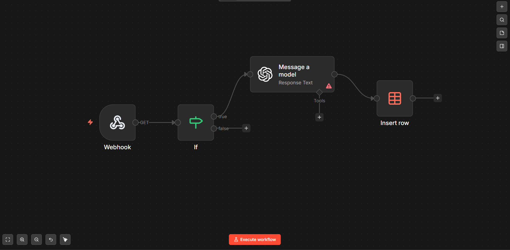

# Automacao-triagem-etica-n8n
Sistema de triagem de leads com IA (OpenAI), focado em LGPD e Design Ético.

# 🤖 Automação de Triagem Ética com IA

Este projeto foi desenvolvido como parte da disciplina de automação, utilizando o **n8n** rodando em **Docker** e integração com **OpenAI (GPT-4o)**.

## 🚀 Funcionalidades
- **Captura via Webhook:** Recebimento de leads em tempo real.
- **Triagem Inteligente:** Classificação de candidatos/leads via LLM.
- **Design Ético (LGPD):** Implementação de técnicas de anonimização e foco em Hard Skills para evitar vieses de gênero e origem.
- **XAI (IA Explicável):** Justificativas automáticas para cada decisão da IA.

## 🛠️ Tecnologias
- n8n (Low-code Automation)
- OpenAI API
- Docker
- SQLite / Data Tables
